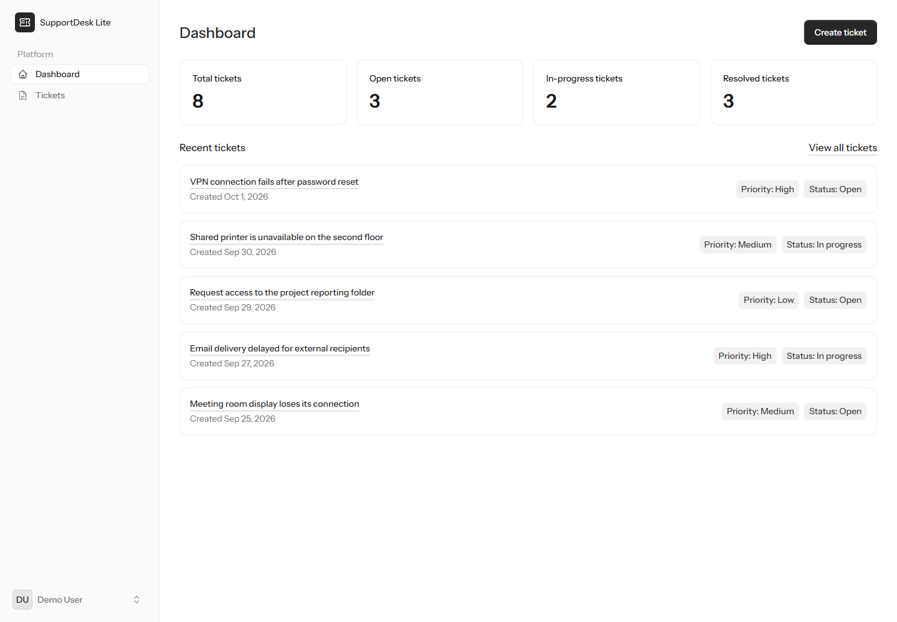
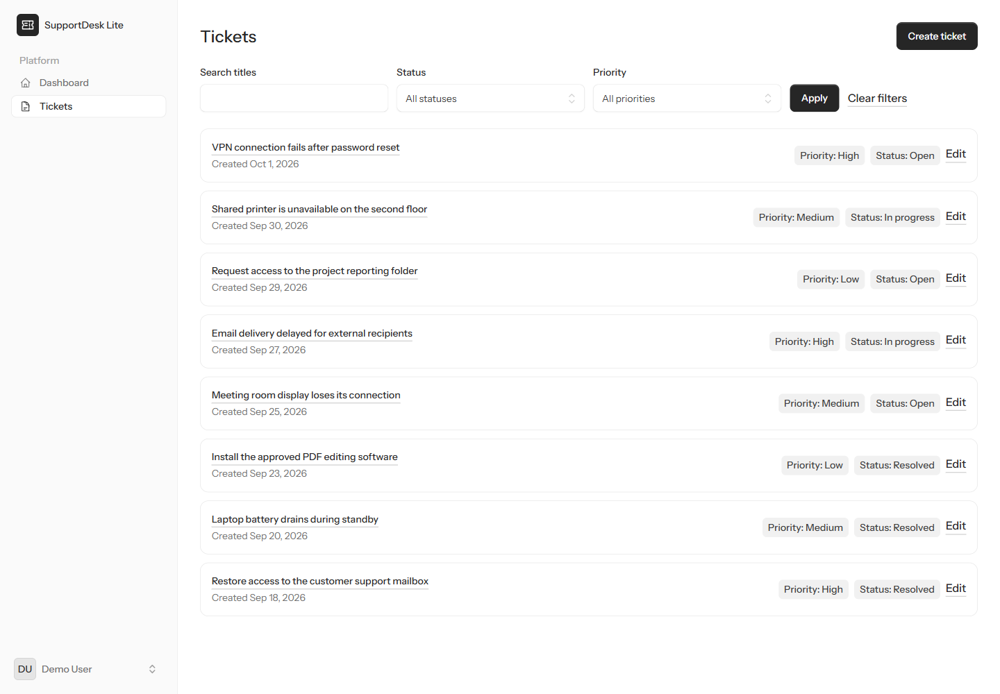

# SupportDesk Lite

**Simple support ticket management.** A focused Laravel application for creating, organizing, tracking, and resolving support tickets from one dashboard.

Built as a practical portfolio project while learning modern PHP and Laravel, with experience from React, Node.js, Express, and SQL development.

## Screenshots

Real application pages using fictional local demo data. Desktop captures use a 1440px viewport; the mobile dashboard uses 390px.

| Dashboard | Ticket list |
| --- | --- |
| [](docs/screenshots/dashboard.png) | [](docs/screenshots/tickets.png) |

More views: [Landing page](docs/screenshots/landing-page.png) · [Ticket details](docs/screenshots/ticket-details.png) · [Mobile dashboard](docs/screenshots/mobile-dashboard.png).

## Features

- Authentication and email verification through Laravel's official Livewire starter kit.
- User-owned tickets with full create, read, update, and delete operations.
- Low, medium, and high priorities; open, in-progress, and resolved statuses.
- Title search and combinable status/priority filters, with pagination.
- Dashboard statistics and the five most recently created tickets.
- Ownership policies, server-side validation, and a responsive interface.
- Automated Pest tests and an explicit local demo seeder.

## Technology stack

PHP 8.4, Laravel 13, Livewire 4, Blade, Flux UI, Tailwind CSS 4, SQLite, Pest, and Vite (via Vite Plus).

## Architecture

Requests enter named routes in `routes/web.php`. The dashboard and ticket routes use `auth` and `verified` middleware. Controllers coordinate the request; Form Requests validate input and authorize relevant actions, while `TicketPolicy` enforces ownership.

`User` has many `Ticket` records, and each ticket belongs to a user. Eloquent translates relationship-scoped queries into SQL for SQLite. Dashboard counts are grouped in the database rather than calculated by loading every ticket into PHP.

Ticket pages use traditional controllers and Blade views. The starter kit provides Livewire authentication/settings pages and shared UI components. This combines familiar MVC request handling with interactive server-rendered components.

## Local installation

Prerequisites: Git, PHP 8.4 with OpenSSL and PDO SQLite enabled, Composer, and a Node.js version supported by Vite 8 (Node 22.12+ is suitable). Run these commands in PowerShell from your development directory:

```powershell
git clone https://github.com/Kehinde13/LaravelSupportDesk.git
cd LaravelSupportDesk
composer install
copy .env.example .env
php artisan key:generate
if (-not (Test-Path database/database.sqlite)) {
    New-Item -ItemType File -Path database/database.sqlite | Out-Null
}
php artisan migrate
npm.cmd install
npm.cmd run build
composer run dev
```

These instructions are for a fresh clone: keep an existing `.env` rather than overwriting local settings. The SQLite creation command preserves an existing database. On macOS/Linux, use `cp .env.example .env`, `touch database/database.sqlite`, and `npm` instead of `npm.cmd`; the database file must exist before migrations run.

The example environment already selects SQLite and `APP_ENV=local`. Open the local address printed by the development command, normally `http://localhost:8000`. Stop the development processes with Ctrl+C. PowerShell uses `npm.cmd` to avoid execution-policy restrictions on `npm.ps1`.

Newly registered users must verify their email before accessing tickets or the dashboard. With the default `MAIL_MAILER=log`, verification messages are written to `storage/logs/laravel.log` instead of being sent to an inbox. Use the local verification link there, or use the already-verified demo account below. Keep log contents private.

## Local demo data

Run explicitly after migrations, in a second terminal if the server is running:

```powershell
php artisan db:seed --class=DemoSeeder
```

| Field | Value |
| --- | --- |
| Email | `demo@supportdesk.test` |
| Password | `password` |

**These public credentials and the seeder are for local development only. Never use this account in production.** `DemoSeeder` accepts only `local` and `testing` environments and refuses production. It is not called by `DatabaseSeeder`.

The seeder creates a verified Demo User and eight fixed tickets: three open, two in progress, and three resolved, spanning all priorities and varied creation dates. Repeating it does not duplicate unchanged demo records or alter other users' tickets. It restores the demo credentials and seeded fields; titles identify demo tickets, so renaming or deleting them can cause replacement records on a later run.

## Testing

```powershell
php artisan test
composer validate --strict
npm.cmd run build
```

On other systems, use `npm run build`. Pest covers authentication, ticket relationships, authorization, validation, CRUD, filtering, dashboard statistics, demo seeding, and branding. Tests use an in-memory SQLite database configured in `phpunit.xml`, keeping the local demo database separate.

## Security decisions

- Ownership is assigned on the server through the authenticated user's `tickets()` relationship. `user_id` is excluded from mass assignment.
- Policies reject access to another user's ticket; route model binding does not replace authorization.
- Controllers persist only validated fields. Creation excludes client-supplied status so the database defaults it to `open`.
- State-changing forms use CSRF protection and appropriate HTTP methods.
- `.env`, the local SQLite database, dependencies, and generated build output are excluded from Git. Only `.env.example` is shared.

## Project structure

| Location | Purpose |
| --- | --- |
| `routes/web.php` | Public home, protected dashboard, and resourceful ticket routes |
| `app/Http/Controllers/` | `TicketController` CRUD and `DashboardController` statistics |
| `app/Http/Requests/` | `IndexTicketRequest`, `StoreTicketRequest`, and `UpdateTicketRequest` |
| `app/Policies/TicketPolicy.php` | Ticket permissions and ownership checks |
| `app/Models/` | `User` and `Ticket` Eloquent relationships |
| `app/TicketPriority.php`, `app/TicketStatus.php` | Backed enums used for casts, validation, and options |
| `resources/views/` | Landing page, dashboard, ticket views, layouts, and Livewire pages |
| `app/Livewire/` | Supporting Livewire actions, including logout |
| `database/migrations/` | Versioned database schema, foreign keys, and defaults |
| `database/factories/`, `database/seeders/DemoSeeder.php` | Test data factories and explicit local demo data |
| `tests/Feature/` | Request, authentication, and application behavior tests |
| `docs/screenshots/` | Real desktop and mobile application captures |

## What I learned

This project gave me hands-on practice with Laravel MVC, Eloquent relationships, schema migrations, Form Requests, and authorization policies. Coming from Express and Prisma, I learned how Laravel connects these responsibilities through framework conventions. I used Blade for ticket pages, worked with the Livewire starter kit for authentication and shared presentation, wrote repeatable seed data, and tested server-side behavior with Pest. This is learning and portfolio experience, not a claim of professional Laravel tenure.

## Author

**Kehinde Balogun**

[GitHub](https://github.com/Kehinde13) · [Portfolio](https://kehindebalogun.netlify.app/)

## Future improvements

Potential next steps include ticket email notifications, administrator workflows, attachments, and validating a production database configuration. These are not implemented ticket features.
